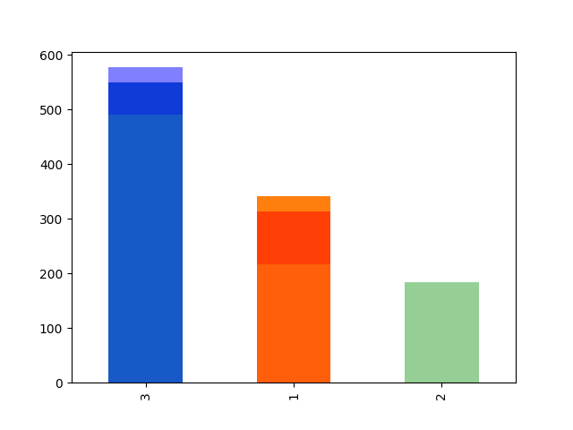
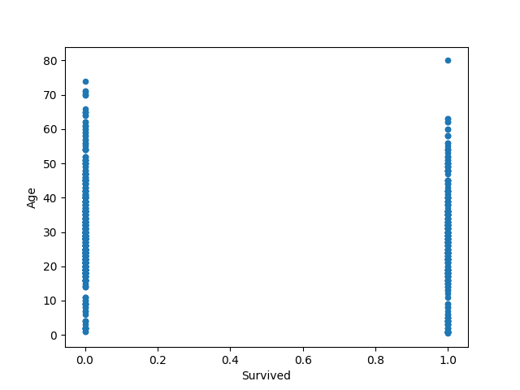

# Data-analysis-Titanic
Simple Data Analysis and Visualization using python (Titanic data set).
The dataset was obtained from [Kaggle Datasets](https://www.kaggle.com/broaniki/titanic)

# Required packages
1. pandas
2. numpy
3. maplotlib

# How to

1. Clone the repo
2. Open in terminal (with the packages installed)
3. Run `python Titanic.py`

That's all :smile:

# Result
> Bar plot

> Scatter plot

